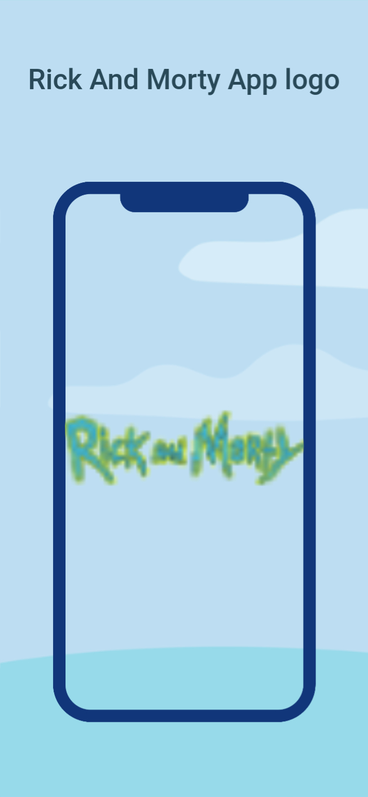

 # Rick and Morty App
 
   Description :
   This repository contains the source code for the "Rick and Morty" app, which showcases various characters from the popular TV show "Rick and Morty". The app is built using Flutter and provides detailed information about each character, including the episodes they appear in.
   
      Directory Structure
        
        lib
        ├── model
        │   ├── core
        │   │   ├── api_urls.dart
        │   │   └── service
        │   │       ├── remote
        │   │       │   ├── api_error_handler.dart
        │   │       │   ├── api_response.dart
        │   │       │   ├── dio_service.dart
        │   │       │   └── character_service.dart
        │   └── character
        │       ├── model
        │       └── view
        │           ├── widgets
        │           │   └── character_screen.dart
        │           └── viewModel
        │               └── character_view_model.dart
        ├── utils
        │   ├── colors.dart
        │   └── styles.dart
        └── view
        ├── widgets
        │   ├── landing_page.dart
        │   └── splash_screen.dart
        └── viewModel
        └── landing_view_model.dart

    Dependencies
    The project uses the following dependencies:
    
    flutter: The core Flutter framework.
    provider: State management library.
    flutter_screenutil: A flutter plugin for adapting screen and font size.
    dio: A powerful HTTP client for Dart.
    internet_connection_checker: A package for checking internet connection status.
    lottie: A library to parse Adobe After Effects animations exported as JSON with Bodymovin and renders them using Flutter.
    url_launcher: A Flutter plugin for launching URLs.
    flutter_launcher_icons: A package which simplifies the task of updating your Flutter app's launcher icon.
    Project Setup
    To set up the project, follow these steps:

                1. Clone the repository:
   
                  git clone https://github.com/your-username/rick-and-morty-app.git
           
               2. Navigate to the project directory:
                  cd rick-and-morty-app
                  3. Install the dependencies:
                     flutter pub get
                  4. Run the project:
                     flutter run
                     File Overview
                  1. Character List Screen
                     The CharacterListScreen is the main screen that displays a list of characters. It loads characters from a remote source and displays them in a grid view.
               
                  2. Character Detail Screen
                     The CharacterDetailScreen shows detailed information about a selected character, including their name, status, species, gender, origin, and last known location. It also lists the episodes the character appears in.
               
                  3. Landing ViewModel
                     The LandingViewModel manages the state of the current selected character and the navigation index.
                  4. Search Screen 
                     Search for characters by name.
               
                  5. Splash Screen
                     The SplashScreen is displayed when the app is first launched. It shows an animated logo and transitions to the main content after a short delay.
               
                  6. App Logo
                     The app logo is defined in the pubspec.yaml file under flutter_launcher_icons. The logo is located in the assets/logo directory.
               
               Ensure the logo image is located at assets/logo/applogo.png.

  ##Screenshots
<table>
  <tr>
    <td></td>
    <td></td>
    <td></td>
  </tr>
</table>
       
     Conclusion
       This README provides an overview of the project structure, dependencies, and setup instructions. Additionally, it outlines identified issues and their solutions, along with updated code snippets to improve the app's performance and user experience.
       
       For any further questions or contributions, feel free to open an issue or submit a pull request. Happy coding!
APK Download
        Download [Rick And Morty APK](https://drive.google.com/drive/folders/1v8IfzyHsh1FydTmpE9fm0uBjBvjXxtSH?usp=sharing)

